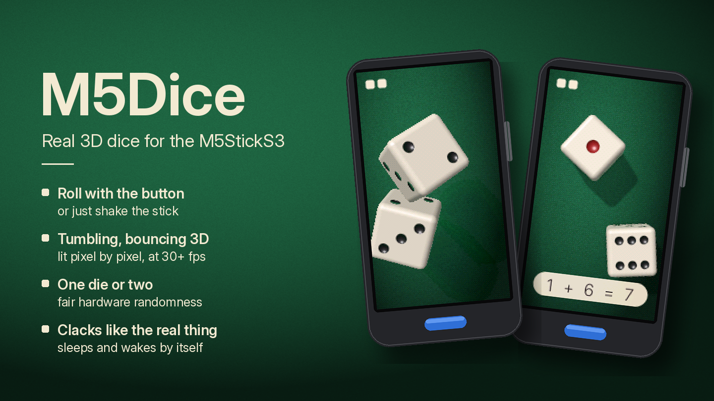

# M5Dice

Real 3D dice for the [M5StickS3](https://docs.m5stack.com/en/core/StickS3).



Press the blue button or just shake the stick: the dice fly up, tumble,
bounce off the green felt and come to rest face up, every time at a different
spot and angle. One fixed light shades them pixel by pixel, so their faces
brighten and darken as they turn, with soft shadows, rounded edges and
dimpled pips. Every bounce clacks through the speaker.

- Real-time 3D: a software renderer running on both cores of the ESP32-S3,
  30 to 45 frames per second
- One die or two; the result is shown under the dice, like "1 + 6 = 7"
- Fair throws from the ESP32's hardware random number generator
- Shake to roll: the dice rattle while you shake and fly when you stop
- The screen sleeps after a minute without use and wakes up, showing the last
  throw, when you pick the stick up

## Controls

Hold the stick upright, screen towards you. It starts with one die.

| Input | Action |
|---|---|
| KEY1 (the blue button on the front) | Throw |
| Shake the stick | Rattle, then throw when you stop |
| KEY2 (the button on the edge) | One die / two dice |

Double-press the power button to switch the stick off.

## Install

**M5Burner.** Find M5Dice in the StickS3 firmware list (category Games) and
burn it. The listing went up for review on 2026-10-03; it is described in
[docs/m5burner.md](docs/m5burner.md).

**From source.** With [PlatformIO](https://platformio.org) installed:

```bash
pio run -e sticks3 -t upload
```

If uploading cannot connect, hold the side button until the green LED blinks
(download mode), upload, then press the side button once.

## How it works

Everything that is not hardware lives in `lib/` as plain C++ and is tested
on the host; `src/` only wires it to the board.

- **Dice.** Each die is a cube with rounded edges, a 9 x 9 grid of points a
  face, seen by a perspective camera above the table. The flat middle of a
  face is one color plus pips drawn as concave dimples; the bent edges are lit
  at their vertices and blended across.
- **Speed.** The ESP32-S3 has no hardware division or square root that the
  compiler uses, so the hot loops do without: fast reciprocal square roots,
  lookup tables, fixed-point steps along each row. Only the part of the
  screen where the dice move is redrawn and sent to the display, and the rows
  are split between the two cores.
- **Throw.** A throw is planned whole when it starts: each die's value comes
  first, then where and how it will lie, then a flight that ends there
  exactly, with three ever lower bounces, a slide and a little rocking.
- **At rest.** When the dice stop, the frame is drawn once more at four
  samples per pixel, so the resting dice have smooth edges.
- **Sound.** The clacks are synthesized for each throw from its bounces:
  filtered noise, a short ping and a low knock, timed to the motion.

## Development

```bash
pio test -e native                                 # unit tests of lib/
tools/preview/build.sh && /tmp/dice_preview /tmp/sheet.png   # screens on the Mac
python3 tools/make_ui_assets.py                    # after changing any text
```

- `tools/prototype/dice.html` is the interactive prototype the look was chosen
  from.
- `tools/serial_cmd.py` drives the board over USB for testing: screenshots,
  key presses, simulated shakes, frame timings.
- [CLAUDE.md](CLAUDE.md) has the details: architecture, board quirks,
  publishing.

The text on the screen is set in [Inter](https://rsms.me/inter/)
(`assets/fonts`, SIL Open Font License).
